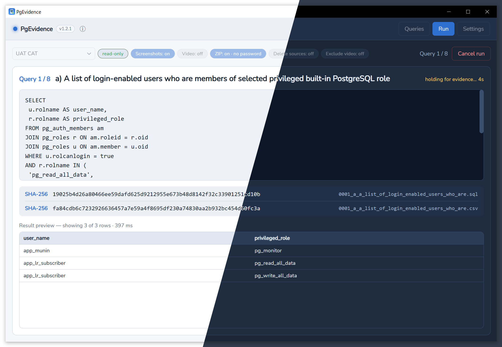

PgEvidence runs a set of read-only SQL queries against PostgreSQL one by one. It
**takes a screenshot of each result as it appears on screen** (with the OS clock in
frame) and/or **records a video of the whole process**. Alongside, it saves each
result as CSV with a checksum, so you end up with a set of files you can hand to an
auditor.

## Results

Each run writes a timestamped folder. Per query (`NNNN_<slug>`):

- `NNNN_<slug>.png` — full-screen screenshot of the result, including the OS clock
- `NNNN_<slug>.csv` — the result rows, via `psql`
- `NNNN_<slug>.csv.sha256` — SHA-256 checksum of the CSV (`sha256sum` format)
- `NNNN_<slug>.sql` — the query text (optional)

Plus, per run:

- `run.mp4` — screen recording of the whole run (optional)
- `manifest.json` + `manifest.json.sha256` — run summary and its checksum
- `<run>.zip` (+ `.zip.pwd`) — optional archive of everything above

Verify any file with `sha256sum -c <name>.sha256`.

## Highlights

- Screenshot and/or video of the process
- Signs result files with a hash, stored in a standard format
- Import multiple SQL queries from pasted text
- Uses the system `psql` to retrieve results

:::note
Requires the PostgreSQL client (`psql`) on the machine running the app.
:::

See [Installation](/PgEvidence/installation/) and [Usage](/PgEvidence/usage/).
