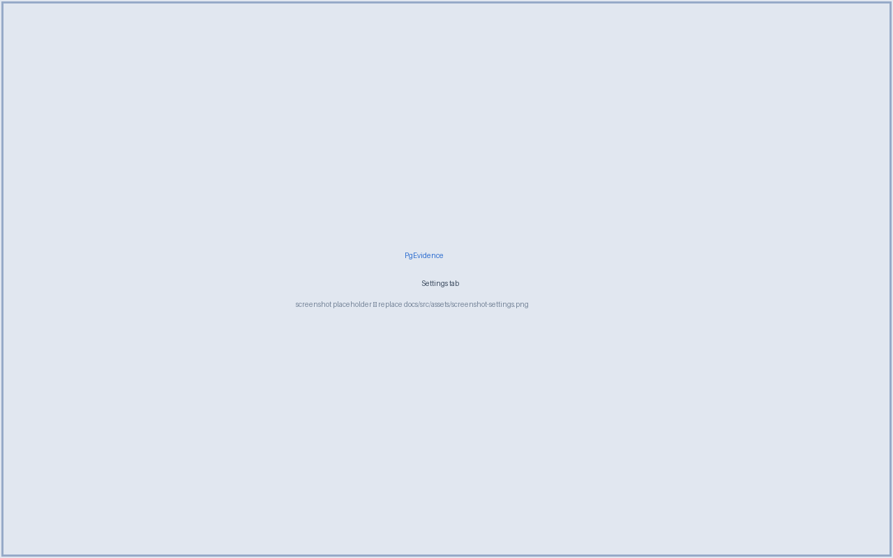
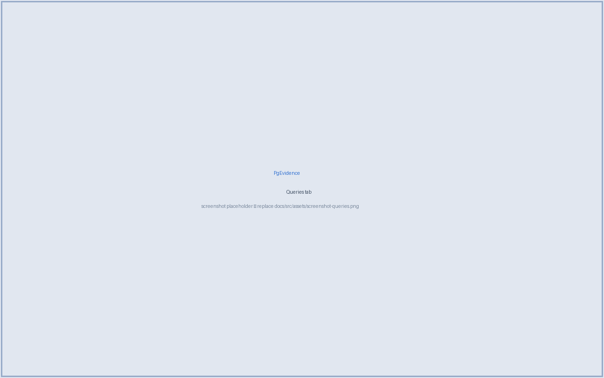

PgEvidence has three tabs: **Settings**, **Queries**, and **Run**.

## Settings

Define your database connection(s) — host, port, database, user, SSL mode. **Changes save
automatically** (there's no Save button). Optionally type a session password (held in memory
only; empty the field to clear it) or rely on `~/.pgpass`, and use **Test connection** to
verify. You can also choose the **theme** (System / Light / Dark) and point the app at a
custom `psql` or `ffmpeg` binary (blank = auto-detect).



## Queries

Add, edit, remove, and **drag the handle to reorder** queries — or **Import all** to paste a
JSON set or a plain `.sql` script (split on semicolons). On import, the free text before each
query (a description and/or `--` comment) becomes its **name** and is excluded from the SQL.
**Export all** saves your set as JSON.



## Run

Pick the connection from the dropdown, toggle **Screenshots** / **Video** as needed, then
**Start run**. Each query runs in order and is shown on screen with its checksum and a result
preview; the evidence folder opens when the run completes.

## Archiving

Enable **Create a ZIP archive** (Settings → Archive). Password protection can be **none**,
**explicit**, or **auto-generated** (saved next to the archive as `<name>.zip.pwd`). Encryption
is legacy **ZipCrypto** for broad compatibility (opens with macOS `unzip`, Windows Explorer,
7-Zip). Optionally **delete source files** after zipping, or **exclude the video** from the ZIP
(large recordings compress poorly).

## Verifying the evidence

```bash
cd audit-run-YYYYMMDD-HHMMSS
sha256sum -c *.csv.sha256          # every CSV result
sha256sum -c manifest.json.sha256  # the run manifest
```
